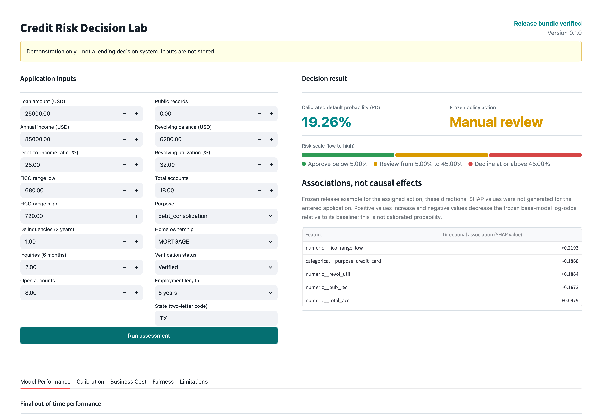

# Credit Risk Prediction

An end-to-end portfolio project for estimating 36-month consumer-loan default risk from
application-time information. The frozen release combines a `ColumnTransformer`, a weighted
LightGBM challenger, sigmoid probability calibration, an approve/review/decline cost policy,
SHAP diagnostics, and subgroup reliability checks.

This is a demonstration only, not a production lending decision system. The final model has
modest discrimination, and its frozen policy sends 90.6% of the test population to manual
review while declining no applications.

## Live Demo and Screenshot

Live demo: <https://credit-risk-prediction-zeroth.streamlit.app/>



The screenshot was captured from the container image running the committed `artifacts/release/`
bundle, showing the synthetic example scored at a 19.26% calibrated default probability and
routed to manual review. The application verifies every manifest hash before loading artifacts
and labels the experience as a demonstration rather than a lending decision tool.

## Business Problem

For a lender, a default probability is useful only when it is estimated from information
available at decision time, holds up on later borrowers, and can support an explicit operating
policy. The project therefore treats credit risk as four connected problems:

- rank applicants by default risk;
- produce probabilities that correspond to observed default frequencies;
- translate probabilities into approve, manual-review, and decline actions under stated costs;
- expose model associations and subgroup reliability limits for human review.

The target is `bad = 1` for a 36-month loan that ultimately reached `Charged Off` or `Default`.
This is historical risk estimation, not an automated eligibility determination.

## Why Accuracy Is Not Enough

The out-of-time test set contains 42,132 bad loans among 283,026 loans, a prevalence of
14.8863%. Predicting every loan as good would therefore appear to be 85.1137% accurate while
detecting no defaults. That is exactly what the frozen calibrated model does at the
conventional 0.5 classification threshold: TN 240,894, FN 42,132, FP 0, and TP 0.

That 0.5 result is a statement about the threshold, not about the model. Calibrated
probabilities on this population peak at 0.4355, so no application can ever be classified
positive at 0.5, and precision and recall are undefined in substance even though scikit-learn
reports them as zero. Published threshold-dependent metrics therefore use the policy's
`approve_below` boundary of 0.05, which is the approve-versus-refer decision the system
actually makes. Ranking and calibration metrics such as ROC AUC, average precision, Brier
score, and ECE do not depend on any threshold and are unaffected.

The project emphasizes ROC AUC, average precision, Brier score, log loss, calibration error,
the Kolmogorov-Smirnov statistic, temporal slices, and scenario costs. The 0.5 result is kept
prominent because it demonstrates why a probability model and an operating policy must not be
judged by accuracy alone.

## Dataset and Outcome Window

The underlying source is LendingClub. The local CSV was obtained from the Kaggle dataset
[`wordsforthewise/lending-club`](https://www.kaggle.com/datasets/wordsforthewise/lending-club),
published by Kaggle account `wordsforthewise`, and covers 2007 through 2018 Q4. The local copy
receipt/retrieval date is 2026-08-02; its filename is `accepted_2007_to_2018Q4.csv`, size is
1,675,133,810 bytes, and SHA-256 is
`3eae03c28fd9d2e8a076ebeb73507e8d4d0f44d90500decdb0936e0933d1f36a`.

The Kaggle version ID and license metadata were not persisted with the local snapshot. This
repository does not redistribute the raw CSV. Users must obtain it from the dataset page under
the page's current license and terms.

The population pipeline starts with 2,260,701 accepted-loan rows. After date, 36-month term,
and final-outcome filters, 1,020,768 rows are eligible. Of these, 603,589 fall into the defined
2011-2015 modeling windows and 417,179 are outside the horizon; there are no window-gap rows.
See [the data card](docs/data_card.md) for the complete measured audit, missingness, outcome
mapping, and selection effects.

## Leakage Prevention

The release uses the 17-feature challenger set: 12 numeric and 5 categorical variables that
are available at application or underwriting time. It excludes repayment and collection
fields such as total payments, recovered amounts, outstanding principal, last-payment data,
next-payment dates, and later credit pulls. It also excludes `int_rate`, `grade`, and
`sub_grade` from the release challenger because those fields encode lender underwriting
decisions.

The reported workflow assigns distinct partition roles:

- train fits preprocessors and candidate models;
- validation compares feature sets, models, imbalance strategies, and 30 Optuna trials;
- calibration compares calibration methods, fits the selected calibrator, and selects policy
  thresholds;
- test is reserved for final metrics, policy evaluation, SHAP sampling, and subgroup
  diagnostics.

In the reported workflow, test results are not inputs to model, calibration-method, or
threshold selection.

## Temporal Validation Design

| Partition | Issue dates | Rows | Reported role |
| --- | --- | ---: | --- |
| Train | 2011-01-01 to 2013-12-31 | 157,993 | Preprocessing and model fitting |
| Validation | 2014-01-01 to 2014-06-30 | 71,955 | Model, feature-set, imbalance, and tuning selection |
| Calibration | 2014-07-01 to 2014-12-31 | 90,615 | Calibration evaluation/refit and policy thresholds |
| Test | 2015-01-01 to 2015-12-31 | 283,026 | Reported final evaluation and diagnostics |

The partitions follow issue date rather than a random split. Test prevalence rises from
12.5195% in train to 14.8863% in test, making temporal drift part of the evaluation rather
than something hidden by shuffled folds.

## Models and Imbalance Strategies

Experiments compare a prior dummy classifier, logistic regression, and LightGBM. Logistic
baselines use natural and balanced class weights on challenger and full-underwriting feature
sets. LightGBM experiments compare natural, positive-class-weighted, and randomly
undersampled challenger training, plus a natural full-underwriting diagnostic.

The weighted challenger LightGBM is selected by validation average precision among the
challenger LightGBM strategies. Its positive-class weight is 6.9875. A 30-trial Optuna study
selects 894 estimators, learning rate 0.0107234, 33 leaves, and the remaining regularization
parameters recorded in `artifacts/release/validation_metrics.json`.

### Where the discrimination ceiling comes from

The released model reaches validation ROC AUC 0.6577. The evidence points at the feature set
rather than the algorithm: LightGBM beats logistic regression by only about 0.013 on the same
challenger columns, and the 30-trial Optuna study did not improve on the untuned weighted
model. Adding LendingClub's own `grade`, `sub_grade`, and `int_rate` is worth roughly +0.014,
and those columns are excluded deliberately, because they encode LendingClub's underwriting
decision rather than the applicant.

An offline probe measured what the unused application-time bureau columns are worth. Adding
roughly 35 of them, none in `post_origination` and none from LendingClub's own assessment,
moved validation ROC AUC from 0.6575 to 0.6779, a lift of +0.0204 with a 95% bootstrap
interval of [+0.0176, +0.0234] over 300 resamples. Thirteen of the twenty highest-importance
features were bureau columns. Because those columns are only 76% populated across the
2011-2013 training window, the probe was repeated on 2013 alone, where coverage is 99%; the
lift held at +0.0197, so it is not an artifact of differing imputation.

This is a measured headroom estimate, not a released change. Adopting these features means
handling the vintage coverage gap and re-running calibration, policy selection, fairness, and
explainability end to end. The probe was run on the validation partition only; the test
partition was not touched.

## Probability Calibration

Uncalibrated, sigmoid, and isotonic methods are compared on the calibration partition.
Sigmoid and isotonic evaluation probabilities come from 5-fold stratified out-of-fold
predictions; the selected method is then refit on the full calibration partition. Sigmoid is
selected with calibration Brier score 0.116482, log loss 0.386624, and expected calibration
error 0.000448.

The frozen scoring artifact is a `CalibratedClassifierCV` around the selected LightGBM model.
The calibration figures above use 5-fold out-of-fold predictions on a partition with 14.1257%
prevalence, while the final test metrics use the single sigmoid calibrator refit on the full
calibration partition and a holdout with 14.8863% prevalence. Brier score is prevalence
sensitive, and the protocols differ, so the increase from calibration to test is not proof of
calibration drift. The later test ECE of 0.011108, compared with calibration OOF ECE 0.000448,
is consistent with degraded temporal calibration but is not definitive evidence by itself.

## Business Cost Policy

The base scenario assumes 60% loss given default, 5% foregone margin on a declined good loan,
and USD 30 per manual review. Thresholds are selected on calibration out-of-fold probabilities:

- approve when PD < 0.05;
- manual review when 0.05 <= PD < 0.45;
- decline when PD >= 0.45.

The implemented cost equation is:

```text
proxy_cost = LGD * sum(loan_amnt for approved bad loans)
           + margin * sum(loan_amnt for declined good loans)
           + review_cost * count(manual_review)
```

`manual_review` is modeled as a terminal USD 30 fee only. The reviewer's downstream approval
or decline, subsequent credit loss, and foregone margin are omitted.

On the test set, this policy approves 9.3553%, sends 90.6447% to manual review, and declines
0%. Across USD 3,624,300,800 of test exposure, the partial scenario-cost proxy is USD
16,272,165, or USD 57,493.53 per 1,000 applications. It is not a complete operating-cost
estimate, especially with 90.6% of applications ending at the modeled review fee.

### Why the policy declines nothing

Three reasons, and only the first is mechanical:

1. Calibrated test probabilities span 0.0044 to 0.4355, so no application reaches the 0.45
   decline threshold.
2. The grid search selected 0.45 because cost falls as the threshold rises and then goes flat.
   Declining a good loan forfeits `loan_amnt * margin`, while review is a flat fee, so
   declining is only cheaper when `(1 - PD) * loan_amnt * 0.05 < 30`. At the highest observed
   PD that means a loan under about USD 1,063; the median test loan is USD 10,000. Thresholds
   0.45 through 0.95 tie at the minimum cost, and the stable sort returns the smallest.
3. The cost equation charges manual review a flat fee and stops, so review is a cheap sink
   that absorbs unlimited risk. A cost model that carried the reviewer's eventual approve or
   decline, and a review-capacity limit, would push work back toward automated decisions.

Underlying all three, ROC AUC 0.663 is modest separation, and sigmoid calibration correctly
keeps probabilities near the 14.9% base rate rather than manufacturing unearned confidence.
The result is structural, not a knife-edge parameter choice: all 27 sensitivity scenarios
select the same 0.05/0.45 thresholds with a 0% decline rate.

The 27 calibration sensitivity scenarios span LGD 40%-80%, margin 3%-8%, and manual-review
cost USD 15-60. The partial scenario-cost proxy ranges from USD 29,985.60 to USD 87,387.52 per
1,000. No valid comparator policy is present in the release artifacts, so this project does
not claim an unsupported cost improvement.

## Results

The test partition is reserved for final evaluation, and the reported final evaluation uses
the 2015 holdout. The nominal 95% percentile confidence intervals use 1,000 stratified
bootstrap samples and random seed 42.

| Metric | Test estimate | 95% CI |
| --- | ---: | --- |
| ROC AUC | 0.662707 | [0.660260, 0.665304] |
| Average precision | 0.241568 | [0.238800, 0.244326] |
| Brier score | 0.121539 | [0.121380, 0.121700] |
| Log loss | 0.399637 | Not bootstrapped |
| KS | 0.236654 | Not bootstrapped |
| Expected calibration error | 0.011108 | Not bootstrapped |

ECE is the sample-weighted absolute gap between mean predicted PD and observed default rate
across 10 equal-width probability bins; the final bin includes its upper endpoint.

Threshold-dependent metrics are reported at the policy's approve boundary of 0.05, where
precision is 0.160426, recall is 0.976858, and specificity is 0.105868 (TP 41,157, FP 215,391,
FN 975, TN 25,503). This is a deliberately permissive operating point: the model refers almost
every genuine default onward, at the cost of referring most good applications as well. The
same threshold is used for the monthly temporal slices.

Discrimination is modest. Monthly 2015 ROC AUC ranges from 0.6542 to 0.6742 and monthly ECE
from 0.00235 to 0.01947; these are retrospective stability diagnostics, not evidence of live
production robustness.

## SHAP Explainability

Global SHAP evidence uses a reproducible 5,000-row test sample. The leading associations are
annual income, `fico_range_low` (the lower bound of the reported FICO range), recent inquiries,
loan amount, and debt-to-income ratio. Mean-absolute SHAP importance does not establish a
direction for these features. Local examples are available for approve and manual-review
actions. A decline example is not shown because the frozen test policy produced no declines.

The SHAP values explain the uncalibrated base LightGBM output in raw log-odds units. They are
directional statistical associations, not causal effects, adverse-action reasons, or an
additive decomposition of the calibrated probability.

## Fairness and Subgroup Reliability

The release reports proxy reliability diagnostics for income bands, home ownership,
employment length, and US Census region, with a minimum group size of 200. Selection-rate
ratios are 0.037063, 0.316112, 0.525137, and 0.901025 respectively; equal-opportunity
differences are 0.230278, 0.103537, 0.051544, and 0.010746. One one-row home-ownership group is
suppressed.

Protected attributes are absent, so the analysis cannot assess outcomes by race, ethnicity,
sex, age, or other legally protected classes. These are policy-sensitive proxy reliability
checks only. This is not a statutory fair-lending audit. See the
[fairness report](docs/fairness_report.md) for definitions and interpretation limits.

## Repository Structure

```text
.
|-- app/                    # Read-only Streamlit demonstration
|-- configs/                # Data windows, costs, and feature dictionaries
|-- data/                   # Raw/processed locations; generated data is ignored
|-- docs/                   # Data, model, fairness, and portfolio documentation
|-- scripts/                # Prepare, train, and final-evaluation entry points
|-- src/credit_risk/        # Reusable data, modeling, policy, and diagnostic code
|-- tests/                  # Unit, integration, artifact, and app tests
|-- artifacts/release/      # Genuine local frozen release bundle
`-- reports/figures/        # Generated SHAP figures
```

The genuine `artifacts/release/` directory is preserved locally and is not added by this
documentation change.

## Reproduce Locally

Python 3.12 and access to the Kaggle source CSV are required. Place
`accepted_2007_to_2018Q4.csv` in `data/raw/` after obtaining it under the Kaggle dataset page's
current license and terms. Verify the exact local snapshot:

```bash
shasum -a 256 data/raw/accepted_2007_to_2018Q4.csv
```

Then run:

```bash
uv sync --dev
uv run python scripts/prepare_data.py
uv run python scripts/train.py
uv run python scripts/evaluate.py
uv run streamlit run app/streamlit_app.py
```

Training runs the real 30-trial Optuna study and may take substantial time and memory. The
scripts regenerate ignored processed data and model artifacts; they do not download the raw
dataset.

### Dependency files

`uv.lock` is the source of truth for local development, CI, and the Docker image.
`requirements.txt` exists only because Streamlit Community Cloud reads neither `pyproject.toml`
nor `uv.lock`; it pins the subset of packages the deployed application imports. Because the
release model is a joblib pickle, the deployed scikit-learn and LightGBM versions must match
the versions that trained it, so `tests/test_requirements.py` fails when the two files drift.
Regenerate the pins with `scripts/export_requirements.sh` after changing dependencies.

## Run Tests

```bash
uv run pytest
```

Static checks use `uv run ruff check .`.

## Docker

The image is built from the locked Python 3.12 runtime dependencies and does not install the
development dependency group. It also installs `libgomp1`, the OpenMP runtime that LightGBM
links against and that the slim base image omits.

```bash
docker build -t credit-risk-prediction:local .
docker run --rm -p 8501:8501 credit-risk-prediction:local
```

The frozen bundle in `artifacts/release/` is committed, so a clean clone builds without first
regenerating artifacts. Docker copies that bundle into the image, and the application verifies
every manifest hash before it serves a prediction. Do not load untrusted joblib files; Python
pickle semantics can execute code during deserialization, and manifest hashes verify integrity
rather than authenticate a publisher.

## Limitations and Responsible Use

- The model has modest discrimination and is not suitable for autonomous credit decisions.
- The conventional 0.5 classifier predicts no defaults on test data. Threshold-dependent
  metrics are therefore reported at the policy approve boundary of 0.05, where recall is high
  and precision is low by construction.
- The cost policy sends 90.6% to manual review and declines none, so it is not operationally
  ready without capacity analysis and policy redesign.
- Manual review is modeled as a terminal fee only. The partial cost proxy omits downstream
  reviewer decisions and their credit-loss or foregone-margin outcomes, so it is not a complete
  operating-cost estimate.
- LendingClub accepted loans are a historically selected sample, not the full applicant
  population; rejected-applicant risk and reject inference are unavailable.
- Protected attributes are absent. The project provides no causal interpretation, no
  statutory fair-lending audit, and no legal compliance conclusion.
- Historical results do not establish current or production performance. Deployment would
  require independent validation, governance, monitoring, human oversight, security review,
  accessibility review, and documented adverse-action processes.
- This repository is a portfolio demonstration only, not a production lending decision
  system.

Additional evidence is documented in the [data card](docs/data_card.md),
[model card](docs/model_card.md), [fairness report](docs/fairness_report.md), and
[case study](docs/case_study.md).
